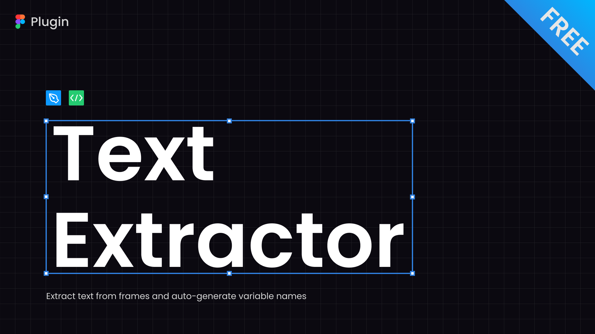

[English](#en) | [한국어](#ko)

# Text Extractor

> A Figma plugin for text extraction and variable name generation

## 📘 Introduction

Effortlessly extract text from frames and auto-generate variable names with our Figma plugin. Perfect for both developers and designers. Try it out directly on the [Figma Community Plugin Page](https://www.figma.com/community/plugin/1517104014625110357).

## 🚀 Plugin Features

#### Extract Text from Selected Figma Frames

Easily extract text from selected frames. Whether you select a single frame or multiple frames, you can quickly extract all the text within them.

#### Automatically Generate Variable Names

Automatically convert extracted text into variable names using camelCase format. This feature supports English text only, ensuring consistent and clean variable naming for your projects.

#### Create Custom Delimiter Sets

Design your own delimiter sets to wrap text with brackets, quotes, or any custom markers. Use intuitive keyboard shortcuts to apply these delimiters, enhancing your workflow for variable processing and other text transformation tasks.

#### Easily Copy and Paste

Effortlessly copy the extracted text and variable names to paste into Google Sheets or other tools.

#### Switch Between Design and Dev Modes

Support both design and dev modes, with dev mode as the default. Use design mode for a compact interface.

## 🔧 How to Use the Plugin

1. Open Figma and navigate to the file you want to work with.
2. Search for `Text Extractor` in the Figma plugin search bar and run it.
3. You can switch between Development and Design modes within the plugin to suit your workflow needs.

---

## 📘 소개

프레임에서 텍스트를 손쉽게 추출하고 변수명을 자동으로 생성할 수 있는 Figma 플러그인입니다. 개발자와 디자이너 모두 사용 가능합니다. [Figma 커뮤니티 플러그인 페이지](https://www.figma.com/community/plugin/1517104014625110357)에서 바로 실행해보세요.

## 🚀 플러그인 기능

#### Figma 프레임에서 텍스트 추출

선택한 프레임의 텍스트를 손쉽게 추출하세요. 프레임 하나를 선택하든, 여러 프레임을 선택하든 프레임 안의 모든 텍스트를 빠르게 추출할 수 있습니다.

#### 자동 변수명 생성

추출된 텍스트를 camelCase 형식의 변수명으로 자동 변환합니다. 영어 텍스트에 최적화되어 있으며, 일관된 변수명을 통해 프로젝트의 가독성을 높입니다.

#### 사용자 정의 구분자 세트 만들기

텍스트를 괄호나 인용 부호 등으로 감싸기 위한 구분자 세트를 만들어보세요. 직관적인 키보드 단축키로 구분자를 적용하여 변수 처리 등 텍스트 변환 작업을 더욱 효율적으로 수행할 수 있습니다.

#### 간편한 복사 및 붙여넣기

추출한 텍스트와 변수명을 복사하여 Google Sheets 등 다른 작업 공간에 쉽게 붙여넣을 수 있습니다.

#### 디자인 모드와 개발 모드 전환

필요에 따라 디자인 모드와 개발 모드를 전환하여 사용하세요. 기본 모드는 개발 모드이며, 디자인 모드에서는 컴팩트한 인터페이스를 제공합니다.

## 🔧 플러그인 사용 방법

1. Figma를 열고 작업할 파일로 이동합니다.
2. Figma 플러그인 검색창에서 `Text Extractor`를 검색하여 실행합니다.
3. 플러그인 내에서 개발 모드와 디자인 모드를 전환하여 필요에 맞게 사용하세요.
